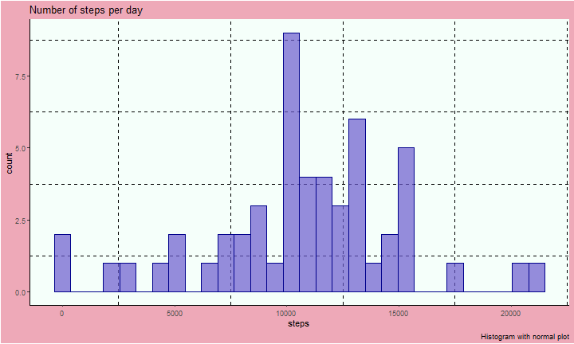

# Preparing the data

This stage will take two steps; reading the data and processing

### Reading the data


```r
url<-download.file("https://d396qusza40orc.cloudfront.net/repdata%2Fdata%2Factivity.zip",destfile = "repdata1")
unzip('repdata1')

df_activity<-read.csv("activity.csv",header = TRUE)
```
### Processing data

The first think I do after reading the data is to convert the date column into a proper date format. Second, I will extract the weekdays and the month from the date variable to use later in the analysis. And finally, I will create the analytic data by calculating the total number of steps for each day, which I will use to answer the first question.


```r
dim(df_activity)
```

```
## [1] 17568     3
```

```r
str(df_activity)
```

```
## 'data.frame':	17568 obs. of  3 variables:
##  $ steps   : int  NA NA NA NA NA NA NA NA NA NA ...
##  $ date    : chr  "2012-10-01" "2012-10-01" "2012-10-01" "2012-10-01" ...
##  $ interval: int  0 5 10 15 20 25 30 35 40 45 ...
```

```r
## convert date to date format
df_activity<-df_activity%>%
  mutate(date=ymd(date))

df_activity<-df_activity%>%
  mutate(interval_week=weekdays(date),
         interval_month=month(date))
## create the analytic data
## aggregate the steps taken over the date variable. This is basically the sum of the total 
## number of steps taken each day, i.e, the sum over all 5 minute intervals
df_analytic<-df_activity%>%
  group_by(date)%>%summarise(steps=sum(steps))
```

### Analysis

Here I will show the response to each of the questions using the data above. To answer this question both the analytic data and the original data give the same result. It is however, a bit confusing since the title says *mean total number of steps taken per day* then <span style- color:'darkred'> question 1 </span> says to make a histogram of *the total number of steps*. 

#### Mean total number of steps taken per day

1. Histogram of the total number steps taken each day


```r
plot1<-df_analytic%>%
  ggplot(.,aes(x=steps))+
  geom_histogram(fill="slateblue",alpha=0.7,color="darkblue")+
  theme_classic()+
  labs(title="Number of steps per day",
       caption = "Histogram with normal plot")+
  theme(plot.background = element_rect(fill = "pink2"),
        panel.background = element_rect(fill="mintcream"),
        panel.grid.minor = element_line(linetype = 2,color = "black"))

plot1
```

```
## `stat_bin()` using `bins = 30`. Pick better value with `binwidth`.
```

```
## Warning: Removed 8 rows containing non-finite values (stat_bin).
```


